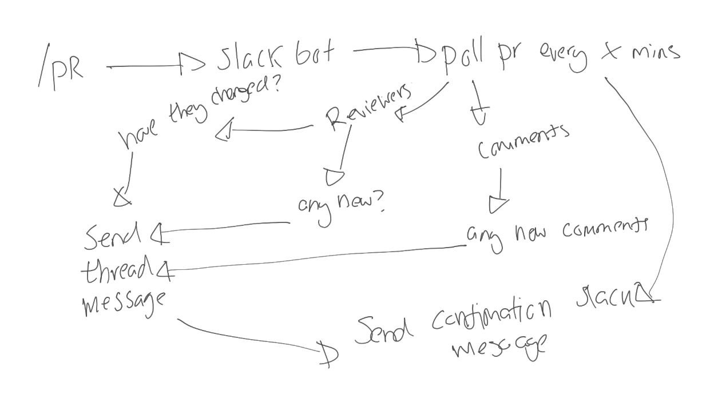

# Slack Bot
## Overview
### Intro
This started as a small Go project to learn and build up my skills and knowledge in Go.

This bot tracks any PRs in Azure Devops for any new comments, reviewers, reviewers changes and status in the PR. It also sends a message using a cron timer to each channel that has tracked PRs to notify the channel of any remaining PRs that are still active.
### The Idea
Starting off the idea was just to have some notifactions for the bot to post messages in a thread to confirm when there was new comments in the PR - the bot kept growing with the more ideas I have, and you can see them at the top of the `main.go` script.

### Features
- Message into slack per tracked PR per channel to alert the wider team
- Further messages in relation to that PR to be sent as a thread message
- Daily reminders of all tracked active PRs per channel
- Notifactions on any new comments made since the last check
- Notifactions on any new reviewers, or reviewers changing their review
- Delete all thread messages + parent message once PR is no longer active (if desired)
- If a user has requested to track a PR that is already being tracked, it will @ them in slack with any new updates
## Slack bot Setup
There's a few different items you will need to get this going
### Basic Information
You will need a few things for the basics, but lets start of with the actual app name. I've called mine **Mario** as he will be supporting the platform team (and he's a platformer!).

The other thing you will need from the basic information page is the **Token**

### Slash Commands
All you need to do is setup a basic **/PR slash** command here

### OAuth & Permissions
Lastly you will need to give your bot some specific scopes, these are **channels:history** and **chat:write**.

You will also need the OAUTH token from here

## Slack Notifactions
### The Initial Message
When we start tracking a PR there is a notifaction to the channel stating that the PR is being tracked. Also the requestee gets a ephemeral message that the request is being processed.

### A Comment Has Been Made
A notifaction is sent to the thread of the initial message, container all unique comment authors

### PR Has Been Approved
A notifaction is sent to the thread of the initial message, container all approving reviewers

### PR Has Been Declined
A notifaction is sent to the thread of the initial message, container all declining reviewers

### PR Has Been Approved & Declined
A notifaction is sent to the thread of the initial message, container all declining & approving reviewers

### PR State Has Changed
A notifaction for when the PR state is changed. Sends a notifaction to the thread if the PR is completed or abandoned. This only happens if the deleteFirstMessage var isn't true

### Adding Member To Already Tracked PR
This one is a little different. If the PR is already being tracked, it sends a emphermiral message to the requestee that it's already being tracked, but they will get further notifactions for that PR. We can see that they are now being mentioned in the thread.

## Console

## Code - Setup options
### Delete Messages Once PR Isn't Active

### Cron For Summary Message

## Code - Functions

### main()

## What's next?
- Containerisation of the application
## Disclaimers
This is my first GO project. I had never used Go before this project and primarily I use Powershell / Python.