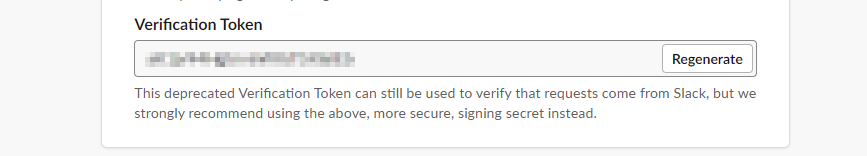
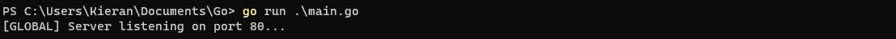
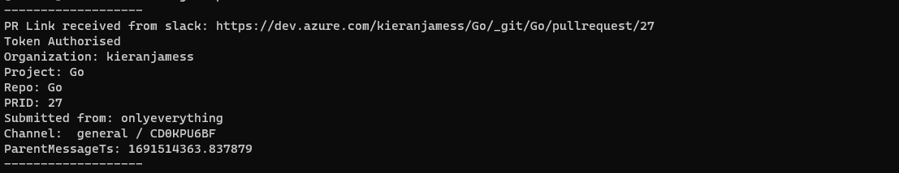

# Slack Bot
- [Slack Bot](#slack-bot)
  - [Overview](#overview)
    - [Intro](#intro)
    - [The Idea](#the-idea)
    - [Features](#features)
  - [Slack bot Setup](#slack-bot-setup)
    - [Basic Information](#basic-information)
    - [Slash Commands](#slash-commands)
    - [OAuth \& Permissions](#oauth--permissions)
  - [Slack Notifactions](#slack-notifactions)
    - [The Initial Message](#the-initial-message)
    - [A Comment Has Been Made](#a-comment-has-been-made)
    - [PR Has Been Approved](#pr-has-been-approved)
    - [PR Has Been Declined](#pr-has-been-declined)
    - [PR Has Been Approved \& Declined](#pr-has-been-approved--declined)
    - [PR State Has Changed](#pr-state-has-changed)
    - [Adding Member To Already Tracked PR](#adding-member-to-already-tracked-pr)
    - [What a Flow Could Look Like](#what-a-flow-could-look-like)
  - [Console](#console)
    - [Starting The Application](#starting-the-application)
    - [Tracking PR](#tracking-pr)
    - [PR Has Changes](#pr-has-changes)
    - [PR Deleting Messages](#pr-deleting-messages)
  - [Code](#code)
    - [Consts](#consts)
    - [Vars](#vars)
  - [Code - Setup options](#code---setup-options)
    - [Delete Messages Once PR Isn't Active](#delete-messages-once-pr-isnt-active)
    - [Cron For Summary Message](#cron-for-summary-message)
  - [Code - Functions](#code---functions)
    - [main()](#main)
    - [func fetchCommentsFromAzureDevOps(azureDevOpsOrganization, azureDevOpsProject, repositoryName, prID string) (\[\]Comment, error)](#func-fetchcommentsfromazuredevopsazuredevopsorganization-azuredevopsproject-repositoryname-prid-string-comment-error)
    - [func getPullRequest(azureDevOpsOrganization, azureDevOpsProject, repositoryName, prID string) (\*PullRequest, error)](#func-getpullrequestazuredevopsorganization-azuredevopsproject-repositoryname-prid-string-pullrequest-error)
    - [func getPullRequestStatus(azureDevOpsOrganization, azureDevOpsProject, repositoryName, prID string) (status string)](#func-getpullrequeststatusazuredevopsorganization-azuredevopsproject-repositoryname-prid-string-status-string)
    - [func sendSlackMessage(slackAccessToken, channelID, message, messageTs, userId string, postEphemeral bool) (message\_ts string)](#func-sendslackmessageslackaccesstoken-channelid-message-messagets-userid-string-postephemeral-bool-message_ts-string)
    - [func postActivePRsMessage(activePrs map\[string\]bool, azureDevOpsOrganization, azureDevOpsProject, repositoryName string)](#func-postactiveprsmessageactiveprs-mapstringbool-azuredevopsorganization-azuredevopsproject-repositoryname-string)
    - [func startCron(azureDevOpsOrganization, azureDevOpsProject, repositoryName string)](#func-startcronazuredevopsorganization-azuredevopsproject-repositoryname-string)
    - [handleSlackSlashCommand(w http.ResponseWriter, r \*http.Request)](#handleslackslashcommandw-httpresponsewriter-r-httprequest)
    - [func reviewersToString(reviewers map\[string\]bool) string](#func-reviewerstostringreviewers-mapstringbool-string)
    - [func deleteThreadMessages(slackAccessToken, channelID string, messages \[\]slack.Message) error](#func-deletethreadmessagesslackaccesstoken-channelid-string-messages-slackmessage-error)
    - [func getThreadMessages(slackAccessToken, channelID, parentTimestamp string) (\[\]slack.Message, error)](#func-getthreadmessagesslackaccesstoken-channelid-parenttimestamp-string-slackmessage-error)
    - [func monitorPr(azureDevOpsOrganization, azureDevOpsProject, repositoryName, parentMessageTs, prID, prLink, userId, channelId string)](#func-monitorprazuredevopsorganization-azuredevopsproject-repositoryname-parentmessagets-prid-prlink-userid-channelid-string)
  - [What's next?](#whats-next)
  - [Disclaimers](#disclaimers)
## Overview
### Intro
This started as a small Go project to learn and build up my skills and knowledge in Go.

This bot tracks any PRs in Azure Devops for any new comments, reviewers, reviewers changes and status in the PR. It also sends a message using a cron timer to each channel that has tracked PRs to notify the channel of any remaining PRs that are still active.
### The Idea
Starting off the idea was just to have some notifactions for the bot to post messages in a thread to confirm when there was new comments in the PR - the bot kept growing with the more ideas I have, and you can see them at the top of the `main.go` script.

### Features
- Message into slack per tracked PR per channel to alert the wider team
- Further messages in relation to that PR to be sent as a thread message
- Daily reminders of all tracked active PRs per channel
- Notifactions on any new comments made since the last check
- Notifactions on any new reviewers, or reviewers changing their review
- Delete all thread messages + parent message once PR is no longer active (if desired)
- If a user has requested to track a PR that is already being tracked, it will @ them in slack with any new updates
## Slack bot Setup
There's a few different items you will need to get this going
### Basic Information
You will need a few things for the basics, but lets start of with the actual app name. I've called mine **Mario** as he will be supporting the platform team (and he's a platformer!).


The other thing you will need from the basic information page is the **Token**

### Slash Commands
All you need to do is setup a basic **/PR slash** command here

### OAuth & Permissions
Lastly you will need to give your bot some specific scopes, these are **channels:history** and **chat:write**.


You will also need the OAUTH token from here

## Slack Notifactions
### The Initial Message
When we start tracking a PR there is a notifaction to the channel stating that the PR is being tracked. Also the requestee gets a ephemeral message that the request is being processed.

### A Comment Has Been Made
A notifaction is sent to the thread of the initial message, container **all unique comment authors**

### PR Has Been Approved
A notifaction is sent to the thread of the initial message, container **all approving reviewers**

### PR Has Been Declined
A notifaction is sent to the thread of the initial message, container **all declining reviewers**

### PR Has Been Approved & Declined
A notifaction is sent to the thread of the initial message, container **all declining & approving reviewers**

### PR State Has Changed
A notifaction for when the **PR state** is **changed**. Sends a notifaction to the thread if the PR is completed or abandoned. This only happens if the deleteFirstMessage var isn't true

### Adding Member To Already Tracked PR
This one is a little different. If the PR is **already being tracked**, it sends a **ephemeral message** to the requestee that it's already being tracked, but they will get further notifactions for that PR. We can see that they are now being mentioned in the thread.

### What a Flow Could Look Like
As we can see below, we have a PR which followed the flow
- Kieran James **approves**
- Kieran James **changes** to **declines**
- Kieran James left a **comment**
- KJ **Declines**
- KJ and Kieran James **changes** vote to **Approves**
- KJ and Kieran James **both** leave 1 **comment** each

## Console
For all functions, there is some **logging** to the **console**. All console messages relating to the monitor of each tracked PR is fixed with a prefix matching `<channel_id>-<pr_id>`
### Starting The Application
When you first start the application there is a global console message

### Tracking PR
WHen sending in a request, this is picked up via the application and logged. If it was job being tracked, this will also start the cron

### PR Has Changes
When a PR has changes, these are logged like below

### PR Deleting Messages
Like above, these changes are logged

## Code
### Consts
```
slackVerificationToken = ""
slackAccessToken       = ""
personalAccessToken    = ""

cronTimer = "0 0 9 * * 1-5" // At 9AM, on a weekday

deleteFirstMessage = false // Delete the first message with all the thread messages once PR is no longer active.
```
the consts constist of the slack tokens needed, the Azure Devops PAT, the cronTimer for the messages and the deleteFirstMessage bool
- slackVerificationToken = Generated from the slack bot
- slackAccessToken = Generated from the slack bot
- personalAccessToken = Azure Devops PAT
- cronTimer = Timer for posting the list of active PRs per channel
- deleteFirstMessage = true/false to delete the message + thread messages once PR isn't active
### Vars
```
var azureDevOpsOrganization string
var azureDevOpsProject string
var repositoryName string

var activeMonitoring = make(map[string]bool) // key: "PRID_channelID", value: true/false
var mutex sync.Mutex                         // Mutex for safe concurrent access to the map

var cronOnce sync.Once
var isCronRunning bool

var interestedUsers = make(map[string][]string) // key: PRID, value: list of user IDs
```
Vars used within the code controlled / used later on

## Code - Setup options
Section for showing how to enable and use the options
### Delete Messages Once PR Isn't Active
```
deleteFirstMessage = false
```
Set the **deleteFirstMessage** to **True**
### Cron For Summary Message
```
cronTimer = "0 0 9 * * 1-5"
```
Set **cronTimer** to a cron of your choosing.
## Code - Functions
Section for showcasing on each of the code functions
### main()
```
func main() {
	http.HandleFunc("/slack/pr", handleSlackSlashCommand)
	fmt.Println("[GLOBAL] Server listening on port 80...")
	http.ListenAndServe(":80", nil)
}
```
Calls and serves traffic based on the /slack/pr endpoint, hitting the `handleSlackSlashCommand` function

### func fetchCommentsFromAzureDevOps(azureDevOpsOrganization, azureDevOpsProject, repositoryName, prID string) ([]Comment, error) 
```
azureDevOpsURL := fmt.Sprintf(
    "https://dev.azure.com/%s/%s/_apis/git/repositories/%s/pullRequests/%s/threads?api-version=6.1",
    azureDevOpsOrganization,
    azureDevOpsProject,
    repositoryName,
    prID,
)

req, err := http.NewRequest("GET", azureDevOpsURL, nil)
if err != nil {
    return nil, err
}
req.SetBasicAuth(personalAccessToken, "")

client := &http.Client{}
resp, err := client.Do(req)
if err != nil {
    return nil, err
}
defer resp.Body.Close()

body, err := io.ReadAll(resp.Body)
if err != nil {
    return nil, err
}

var commentResponse CommentResponse
err = json.Unmarshal(body, &commentResponse)
if err != nil {
    return nil, err
}

var comments []Comment
for _, thread := range commentResponse.Value {
    for _, comment := range thread.Comments {
        if comment.CommentType != "system" { // Check if CommentType is not "system". System comments count as reviewrs approving / declined / rejecting etc
            comments = append(comments, comment)
        }
    }
}

return comments, nil
```
Retrieve all comments on the PR. Ensure that the comment retrieved isn't a system comment also
### func getPullRequest(azureDevOpsOrganization, azureDevOpsProject, repositoryName, prID string) (*PullRequest, error)
```
azureDevOpsURL := fmt.Sprintf(
    "https://dev.azure.com/%s/%s/_apis/git/repositories/%s/pullRequests/%s?api-version=6.1",
    azureDevOpsOrganization,
    azureDevOpsProject,
    repositoryName,
    prID,
)

req, err := http.NewRequest("GET", azureDevOpsURL, nil)
if err != nil {
    return nil, err
}
req.SetBasicAuth("", personalAccessToken)

client := &http.Client{}
resp, err := client.Do(req)
if err != nil {
    return nil, err
}
defer resp.Body.Close()

body, err := io.ReadAll(resp.Body)
if err != nil {
    return nil, err
}

var pr PullRequest
err = json.Unmarshal(body, &pr)
if err != nil {
    return nil, err
}

return &pr, nil
```
Similar to the comments function, get the PR details 
### func getPullRequestStatus(azureDevOpsOrganization, azureDevOpsProject, repositoryName, prID string) (status string) 
```
pr, err := getPullRequest(azureDevOpsOrganization, azureDevOpsProject, repositoryName, prID)
if err != nil {
    fmt.Println("Error:", err)
    return
}

// return error also from other function and check there isn't an error in loop when marking as completed.
return pr.Status
```
Using the PR details, grab the PR status

### func sendSlackMessage(slackAccessToken, channelID, message, messageTs, userId string, postEphemeral bool) (message_ts string)
```
api := slack.New(slackAccessToken)

if postEphemeral {
    message_ts, err := api.PostEphemeral(channelID, userId, slack.MsgOptionText(message, false))

    if err != nil {
        log.Fatalf("Error sending message: %v", err)
    }
    return message_ts

} else {
    _, message_ts, err := api.PostMessage(channelID, slack.MsgOptionText(message, false), slack.MsgOptionTS(messageTs))
    if err != nil {
        log.Fatalf("Error sending message: %v", err)
    }
    return message_ts
}
```
Setup API client, if **postEphemeral** is true, send a ephemeral message to the user (requires **userId** to be passed in), else send a standard message to the channel with the message passed in. Output the **message_ts** which is the message **timeStamp**
### func postActivePRsMessage(activePrs map[string]bool, azureDevOpsOrganization, azureDevOpsProject, repositoryName string) 
```
channelMessage := make(map[string]string)
for key, value := range activePrs {
    if value {
        // Key is in the format "prID_channelID", so split it to get prID and channelID
        parts := strings.Split(key, "_")
        if len(parts) == 2 {
            prID := parts[0]
            channelID := parts[1]
            azureDevOpsURL := fmt.Sprintf(
                "\nhttps://dev.azure.com/%s/%s/_git/%s/pullrequest/%s",
                azureDevOpsOrganization,
                azureDevOpsProject,
                repositoryName,
                prID,
            )

            // Check if the channelID already exists in the channelMessage map
            if existingMessage, ok := channelMessage[channelID]; ok {
                // If the channelID exists, append the new PR URL to the existing message
                channelMessage[channelID] = existingMessage + ", " + azureDevOpsURL
            } else {
                // If the channelID doesn't exist, set the new PR URL as the message
                channelMessage[channelID] = fmt.Sprintf("The follow tracked PRs are still active! Please can we get a review on them today.%s", azureDevOpsURL)
            }
        }
    }
}
// Post messages to each channel for a combined message of every PR. Only post if there are still active PRs
if len(channelMessage) > 0 {
    for channelID, message := range channelMessage {
        sendSlackMessage(slackAccessToken, channelID, message, "", "", false)
        fmt.Println("[GLOBAL] Posting active PRs to", channelID)
    }
}
```
Takes the pool of **active PRs** (in this case, using the **activeMonitoring** map), split the key for each PR up to setup the PR links per channel. If the channel a count of more than 0, post the global message to each of the channels.

### func startCron(azureDevOpsOrganization, azureDevOpsProject, repositoryName string)
```
cron := cron.New(cron.WithSeconds())
cron.AddFunc(cronTimer, func() {
    postActivePRsMessage(activeMonitoring, azureDevOpsOrganization, azureDevOpsProject, repositoryName)
})
cron.Start()
fmt.Println("[GLOBAL] Starting cron")
isCronRunning = true
```
Sets up a function for creating a cron with the passed in **crontimer**. This runs the **postActivePrsMessage** function every time the crontimer triggers.

### handleSlackSlashCommand(w http.ResponseWriter, r *http.Request)
```
token := r.FormValue("token")
if token != slackVerificationToken {
    http.Error(w, "Unauthorized", http.StatusUnauthorized)
    return
}
fmt.Println("Token Authorised")
w.WriteHeader(http.StatusOK)
```
Verifies that the slack token matches before proceeding
```
// Split the URL by "/" to get the parts
parts := strings.Split(prLink, "/")

// Find the index of "_git" and use it to split azureDevOpsOrganization, azureDevOpsProject, and repositoryName
gitIndex := -1
for i, part := range parts {
    if part == "_git" {
        gitIndex = i
        break
    }
}

if gitIndex == -1 || gitIndex+3 >= len(parts) {
    fmt.Println("Invalid URL format")
    return
}

azureDevOpsOrganization = parts[gitIndex-2]
azureDevOpsProject := parts[gitIndex-1]
repositoryName := parts[gitIndex+1]
```
Setup the **azureDevOpsOrganization**, **azureDevOpsProject** and **repositoryName** variables from the passed in link
```
channelID := r.FormValue("channel_id")
key := fmt.Sprintf("%s_%s", prID, channelID)
```
Set the **key** for the locking system 
```
if activeMonitoring[key] {
    // PR is already being monitored, add user to interested users
    fmt.Println("Submitted from:", r.FormValue("user_name"), "\nChannel: ", r.FormValue("channel_name"), "/", r.FormValue("channel_id"), "\nPR is already being monitored, attempting to add user to monitoring list...\n-------------------")
    interestedUsers[prID] = append(interestedUsers[prID], r.FormValue("user_id"))
    mutex.Unlock()
    w.Write([]byte("This PR is already being tracked. You're now interested in this PR, and will be notified of updates.")) // Sending a link to the inital message would be cool
    return
}
```
If the key already exists in the **activeMonitoring** map (The PR is already being tracked), add user to the **interestedUsers** map, and send **ephemeral** **message** back to user to confirm
```
ELSE: 
interestedUsers[prID] = append(interestedUsers[prID], r.FormValue("user_id"))
pr, err := getPullRequest(azureDevOpsOrganization, azureDevOpsProject, repositoryName, prID)
if err != nil {
    fmt.Println("Error:", err)
    return
}
```
Here the PR wont be tracked. Add the requstee to the **interestedUsers**, and get the **PR information**
```
if getPullRequestStatus(azureDevOpsOrganization, azureDevOpsProject, repositoryName, prID) != "active" {
    // Send message back to slack only visible to user to alert the user that PR isnt active.
    fmt.Println("PR isn't active...")
    w.Write([]byte("Please submit an active PR"))
    return
}
```
If the PR isn't in an active state, ask the user to post an active PR via a **ephemeral** message and return out the script
```
firstMessage := fmt.Sprintf("New PR '<%s|*%s*>', created by <@%s>. Tracking PR...",
    prLink,
    pr.Title,
    r.FormValue("user_id"),
)
parentMessageTs := sendSlackMessage(slackAccessToken, r.FormValue("channel_id"), firstMessage, "", "", false)
```
Send the first message to the channel where the request came from, and set the **parentMessageTs** var.
```
if !isCronRunning {
    cronOnce.Do(func() {
        startCron(azureDevOpsOrganization, azureDevOpsProject, repositoryName)
    })
}

// loop until PR isn't active anymore
go monitorPr(azureDevOpsOrganization, azureDevOpsProject, repositoryName, parentMessageTs, prID, prLink, r.FormValue("user_id"), r.FormValue("channel_id"))
```
Check if the **cron** is running. If it isn't, start it. Finally, **start a process to monitor the PR**.

### func reviewersToString(reviewers map[string]bool) string 
```
reviewerList := make([]string, 0)
for reviewer := range reviewers {
    reviewerList = append(reviewerList, reviewer)
}

return strings.Join(reviewerList, ", ")
```
Take in a reviewer map, and output a joined string list 
### func deleteThreadMessages(slackAccessToken, channelID string, messages []slack.Message) error 
```
api := slack.New(slackAccessToken)
for _, msg := range messages {
    _, _, err := api.DeleteMessage(channelID, msg.Timestamp)
    if err != nil {
        return err
    }
}
return nil
```
Iterate through message IDs within a channel and delete them
### func getThreadMessages(slackAccessToken, channelID, parentTimestamp string) ([]slack.Message, error) 
```
	api := slack.New(slackAccessToken)

	params := slack.GetConversationRepliesParameters{
		ChannelID: channelID,
		Timestamp: parentTimestamp,
	}
	messages, _, _, err := api.GetConversationReplies(&params)

	if err != nil {
		return nil, err
	}
	return messages, nil
```
Get all thread messages within a conversation using the channel ID and parent message timestamp. Output for use

### func monitorPr(azureDevOpsOrganization, azureDevOpsProject, repositoryName, parentMessageTs, prID, prLink, userId, channelId string)
```
ticker := time.NewTicker(1 * time.Minute)

// Setup vars
uniqueAuthors := make(map[string]bool)
reviewersApproved := make(map[string]bool)
reviewersDeclined := make(map[string]bool)
prefix := fmt.Sprintf("[%s - %s]", channelId, prID)

var approvedChanged bool
var declinedChanged bool
```
Setup variables used within this function
```
// Fetch comments
comments, _ := fetchCommentsFromAzureDevOps(azureDevOpsOrganization, azureDevOpsProject, repositoryName, prID)
currentCommentCount := len(comments)

// Fetch reviews
reviews := getPullRequestReviewers(azureDevOpsOrganization, azureDevOpsProject, repositoryName, prID)
currentReviewsCount := len(reviews)
```
Fetch the **current comments and reviews** on the PR before hitting the first loop
```
for range ticker.C...
```
Setup a **loop** using the ticker variable
```
interestedUserIDs := interestedUsers[prID]
mentionText := ""
for _, userID := range interestedUserIDs {
    mentionText += fmt.Sprintf("<@%s>", userID)
}
```
Setup the **mentionText** variable to get an update list of users to mention
```
if status := getPullRequestStatus(azureDevOpsOrganization, azureDevOpsProject, repositoryName, prID); status != "active" {
    mutex.Lock()
    key := fmt.Sprintf("%s_%s", prID, channelId)
    delete(activeMonitoring, key)
    mutex.Unlock()
    fmt.Println(fmt.Sprintf("%s PR isn't active, PR state is %s. Removing from being tracked and sending message to thread", prefix, status))
    if deleteFirstMessage {
        fmt.Println(fmt.Sprintf("%s Deleting messages relating to this tracked PR", prefix))
        // Get all thread messages, delete thread messages and then delete master message
        threadMessages, err := getThreadMessages(slackAccessToken, channelId, parentMessageTs)
        if err != nil {
            fmt.Printf(prefix, "Error retrieving thread messages:", err)
            return
        }
        if err := deleteThreadMessages(slackAccessToken, channelId, threadMessages); err != nil {
            fmt.Printf(prefix, "Error deleting thread messages:", err)
            return
        }

    } else {
        // Send message to thread confirming the new state of the PR to the mention list
        statusMessage := fmt.Sprintf("%s The <%s|PR> has been marked as %s and will no longer be tracked.", mentionText, prLink, status)
        sendSlackMessage(slackAccessToken, channelId, statusMessage, parentMessageTs, "", false)
    }
    break
}
```
Get the **status** of the PR. If the status is not active, delete the Key from the **activeMonitoring** map. If **deleteFirstMessage** is **true**, go through all the messages related to the tracked PR and delete the message. **Else**, send a message to the thread with the state of the PR.
```
newComments, err := fetchCommentsFromAzureDevOps(azureDevOpsOrganization, azureDevOpsProject, repositoryName, prID)
if err != nil {
    fmt.Println(prefix, "Error fetching comments:", err)
    continue
}

// Compare new comments with the existing comments
newCommentsCount := len(newComments)
```
Get the comments in a variable called **newComments**
```
if newCommentsCount > currentCommentCount {
    fmt.Println(fmt.Sprintf("%s New comments found! Current Comments: %d, New Comments: %d", prefix, currentCommentCount, newCommentsCount))
    for i := currentCommentCount; i < newCommentsCount; i++ {
        names := strings.Fields(newComments[i].Author.DisplayName)
        if len(names) > 0 {
            firstName := names[0]
            uniqueAuthors[firstName] = true
        }
    }
    var uniqueAuthorsString string
    for firstName := range uniqueAuthors {
        uniqueAuthorsString += fmt.Sprintf("%s, ", firstName)
    }
    uniqueAuthorsString = strings.TrimSuffix(uniqueAuthorsString, ", ")
    threadMessage := fmt.Sprintf("%s There's *%d* new comment(s) on the <%s|PR> left by %s.",
        mentionText,
        newCommentsCount-currentCommentCount,
        prLink,
        uniqueAuthorsString,
    )
    sendSlackMessage(slackAccessToken, channelId, threadMessage, parentMessageTs, "", false)

    // Update the current comment count with the new count
    currentCommentCount = newCommentsCount
}
```
If the **newCommentCount** is higher than the existing comment count, iterate through each new comment and get the **authors** names, ensure there's no dupes and extract their first name. Post a message in the thread with the unique authors.
```
newReviews := getPullRequestReviewers(azureDevOpsOrganization, azureDevOpsProject, repositoryName, prID)
newReviewsCount := len(newReviews)
```
Get the reviews in a variable for comparison
```
// Run both newReviews and currentReviews at the same time at each index, compare the vote at each index.
for i := 0; i < newReviewsCount && i < currentReviewsCount; i++ {
    newReview := newReviews[i]
    currentReview := reviews[i]
    if newReview.UniqueName == currentReview.UniqueName {
        if newReview.Vote != currentReview.Vote {
            if newReview.Vote >= 5 {
                reviewersApproved[newReview.DisplayName] = true
                delete(reviewersDeclined, newReview.DisplayName)
                approvedChanged = true
            } else if newReview.Vote == -10 {
                reviewersDeclined[newReview.DisplayName] = true
                delete(reviewersApproved, newReview.DisplayName)
                declinedChanged = true
            }
        }
    }
}
```
Iterate through both new and existing reviews where unique name is the same. If the vote has changed, remove them from their map and add them to the other map.
```
for i := currentReviewsCount; i < newReviewsCount; i++ {
    newReview := newReviews[i]
    // Process the new review without comparing it to any current review
    if newReview.Vote >= 5 { // Approved with suggestions OR Approved
        reviewersApproved[newReview.DisplayName] = true
        approvedChanged = true
    } else if newReview.Vote == -10 { // Declined
        reviewersDeclined[newReview.DisplayName] = true
        declinedChanged = true
    }
}
```
For any new reviews that don't exist, evalute their vote and add them to the respected map.
```
if approvedChanged || declinedChanged {
    approvedReviewers := reviewersToString(reviewersApproved)
    declinedReviewers := reviewersToString(reviewersDeclined)

    var reviewersThreadMessage string
    if approvedReviewers != "" && declinedReviewers != "" {
        reviewersThreadMessage = fmt.Sprintf("%s There's some new reviews on your <%s|PR>. It has been *approved* by %s and *declined* by %s",
            mentionText,
            prLink,
            approvedReviewers,
            declinedReviewers,
        )
    } else if approvedReviewers == "" && declinedReviewers != "" {
        reviewersThreadMessage = fmt.Sprintf("%s There's some new reviews on your <%s|PR>. It has been *declined* by %s",
            mentionText,
            prLink,
            declinedReviewers,
        )
    } else {
        reviewersThreadMessage = fmt.Sprintf("%s There's some new reviews on your <%s|PR>. It has been *approved* by %s",
            mentionText,
            prLink,
            approvedReviewers,
        )
    }
    fmt.Println(prefix, "Some new reviewers found. Approvers:", approvedReviewers, ",Decliners:", declinedReviewers)
    sendSlackMessage(slackAccessToken, channelId, reviewersThreadMessage, parentMessageTs, "", false)
}
```
If any of the reviews have changed, send an updated list to the thread

## What's next?
- Containerisation of the application
- Helm chart creation? 
## Disclaimers
This is my first GO project. I had never used Go before this project and primarily I use Powershell / Python.